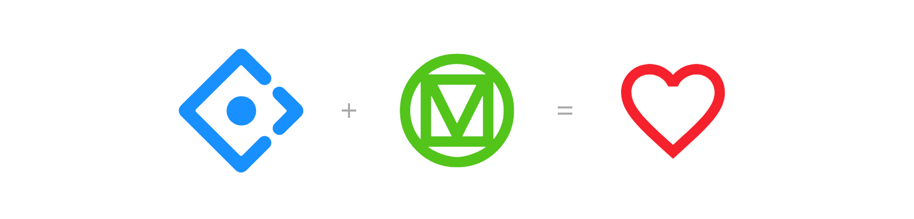

# Ant design icons




[Ant Design](https://ant.design/) + [Material Design Icon](https://materialdesignicons.com/) = [Ant Design Icon](http://2fd.github.io/ant-design-icons)

## install

```bash
  npm install --save @2fd/ant-design-icons
```

```bash
  yarn add @2fd/ant-design-icons
```

## find

Search the icon that you need in the homepage: [`http://2fd.github.io/ant-design-icons`](http://2fd.github.io/ant-design-icons)

> There is more than 5000!

## use

```typescript
import React from 'react'
import CodeTagsIcon from '@2fd/ant-design-icons/lib/CodeTagsIcon

export default function MyComponent() {
  return <CodeTagsIcon />
}
```
